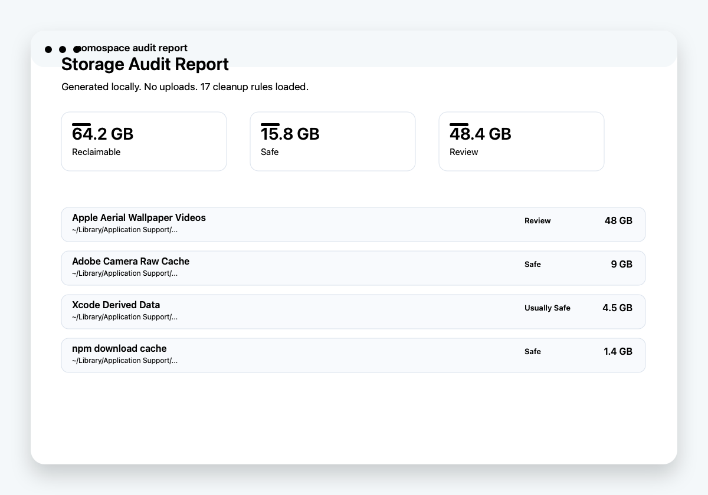

# nomospace

**nomospace is a native Mac Storage Auditor for people whose Mac is full but Apple Storage, CleanMyMac, CCleaner, or generic disk tools did not explain the real cause.**

It finds hidden app-generated storage, explains what created it, labels cleanup risk, and lets users choose what to move to Trash.

> Your Mac is full. nomospace shows exactly why.

**Live landing page:** [nomospace.pages.dev](https://nomospace.pages.dev)  
**Evaluation download:** [nomospace-evaluation.zip](https://github.com/manynames3/nomospace/releases/download/v0.1.0-evaluation/nomospace-evaluation.zip)  
**Status:** direct-download evaluation beta, not notarized for public paid distribution yet  
**Platform:** macOS 14+, SwiftUI, local-first



## Product promise

Apple Storage can show that `System Data` is huge, but it rarely tells users what caused it or what is safe to remove. nomospace turns hidden Library folders, app caches, and developer artifacts into plain-English findings with risk labels and Trash-first cleanup.

## Who it is for

- Mac users with large "System Data" or unexplained storage pressure.
- Photographers and creators with Adobe, Lightroom, Aftershoot, or media caches.
- Developers with Xcode, simulator, npm, pnpm, pip, uv, or local tool caches.
- Technical family/office helpers who need a clear cleanup report before deleting anything.

## What it does today

- Scans known hidden-storage locations and large first-level folders.
- Labels findings as `Safe`, `Usually Safe`, `Review`, or `Do Not Auto-Select`.
- Explains what each finding is and what happens if it is removed.
- Searches and filters findings by source, path, category, and risk.
- Evaluation mode scans the Mac and shows risk-labeled findings.
- Full access unlocks Trash-first cleanup, local cleanup receipts, and PDF audit reports.
- Provides a sharable landing-page link.
- Shows skipped paths so users know when Full Disk Access may be needed.
- Stores access-code activation locally on the Mac.

## What it does not do

- It does not upload file names, file contents, browser data, or cleanup history.
- It does not permanently delete files. Users empty Trash later if they are comfortable.
- It does not remove protected personal folders automatically.
- It is not antivirus, a duplicate finder, a RAM booster, or a broad app uninstaller.
- The local access-code gate is a beta monetization mechanism, not strong anti-piracy.

## Repository map

```text
Sources/nomospace/        Native SwiftUI macOS app
Sources/nomospace/Resources/Rules/storage-rules.json
                           Bundled hidden-storage rule library
Packaging/                Info.plist and app icon
landing/                  Static sales page deployed to Cloudflare Pages
scripts/                  App packaging, smoke tests, and generated assets
docs/                     Product scope and sellable-MVP notes
```

## Key workflows

- **Audit:** scan known high-signal storage locations and large first-level folders.
- **Explain:** show size, exact path, category, risk, cause, and side effect.
- **Select:** auto-select only `Safe` and `Usually Safe` findings.
- **Unlock:** enter an access code to enable full functionality on this Mac.
- **Clean:** move selected items to macOS Trash first with full access.
- **Report:** copy a sharable product link or save a local PDF audit report for support or before/after proof.

## Run locally

```sh
cd nomospace
swift run nomospace
```

This Swift Package builds a native SwiftUI macOS executable. `scripts/package-app.sh` creates a local evaluation `.app`; public website distribution still needs Developer ID signing and notarization.

## Build a local `.app`

```sh
cd nomospace
chmod +x scripts/package-app.sh
scripts/package-app.sh
open .build/release/nomospace.app
```

## Build the downloadable ZIP

```sh
cd nomospace
chmod +x scripts/package-download.sh
scripts/package-download.sh
```

The ZIP is written to `.build/dist/nomospace-evaluation.zip` and is intended for GitHub Releases or direct website hosting. It is not committed to the source repo.

To regenerate the app icon:

```sh
cd nomospace
swift scripts/make-icon.swift
```

## Smoke test

```sh
cd nomospace
scripts/test.sh
```

The smoke test builds the app, validates packaging metadata, validates the bundled rule JSON, and runs the app's `--self-test` mode to confirm the cleanup rule library is available at runtime.

## Sales landing page

The static sales page lives in `landing/` and is deployed to Cloudflare Pages.

Live production URL: [https://nomospace.pages.dev](https://nomospace.pages.dev)

```sh
cd nomospace
swift scripts/make-landing-assets.swift
python3 -m http.server 8788 -d landing
wrangler pages deploy landing --project-name nomospace --branch main
```

## Demo flow

1. Launch the app.
2. Read the first-run trust panel.
3. Optional but recommended: open Full Disk Access and grant access to `nomospace`.
4. Run Storage Audit.
5. Search or filter findings.
6. Expand a finding to see path, source, risk rule, and side effect.
7. In evaluation mode, click `Enter Code` or `Unlock Cleanup` to show the access-code flow.
8. After full access is unlocked, use `Save PDF` if the user wants proof before cleanup.
9. Select only `Safe` or `Usually Safe` items for the demo.
10. Click `Move to Trash`.
11. Open `History` to see the local cleanup receipt.

## Monetization direction

The most realistic first paid offer is a simple utility purchase:

- Evaluation mode: scan, findings, paths, risk explanations, filters, and Sharable Link.
- Full-access code: move to Trash, cleanup history, and Save PDF.
- Suggested beta price: $19 one-time for early adopters.
- Later price: $29-$39 one-time or annual updates for the rule library.

The current unlock flow validates a local access code and stores activation in `UserDefaults`. That is enough to test willingness to pay for a direct-download beta, but a serious public release should eventually use a payment provider, license API, signed license file, or per-customer codes.

The strongest first customer niche is Mac photographers, creators, and developers who have urgent disk pressure and cannot safely interpret `~/Library` on their own.

## Product principles

- Audit before cleanup.
- Show human explanations, not just paths.
- Default to moving items to Trash.
- Never auto-select personal files, browser profiles, cloud folders, or risky app data.
- Every finding should answer: what is this, why is it big, and what happens if I remove it?

## Verification checklist

Before demoing or shipping a build:

```sh
scripts/test.sh
scripts/package-app.sh
scripts/package-download.sh
codesign --verify --deep --strict .build/release/nomospace.app
.build/release/nomospace.app/Contents/MacOS/nomospace --self-test
```

The self-test confirms that the bundled cleanup rule library is available at runtime.

## Privacy

See [PRIVACY.md](PRIVACY.md).

## Current MVP limits

- The app is not notarized yet.
- Payments are not implemented yet; activation currently uses a local beta access code.
- The rule library is bundled with the app, not remotely updated.
- The scanner is optimized for high-signal known paths and large folders, not exhaustive file-by-file analysis.
